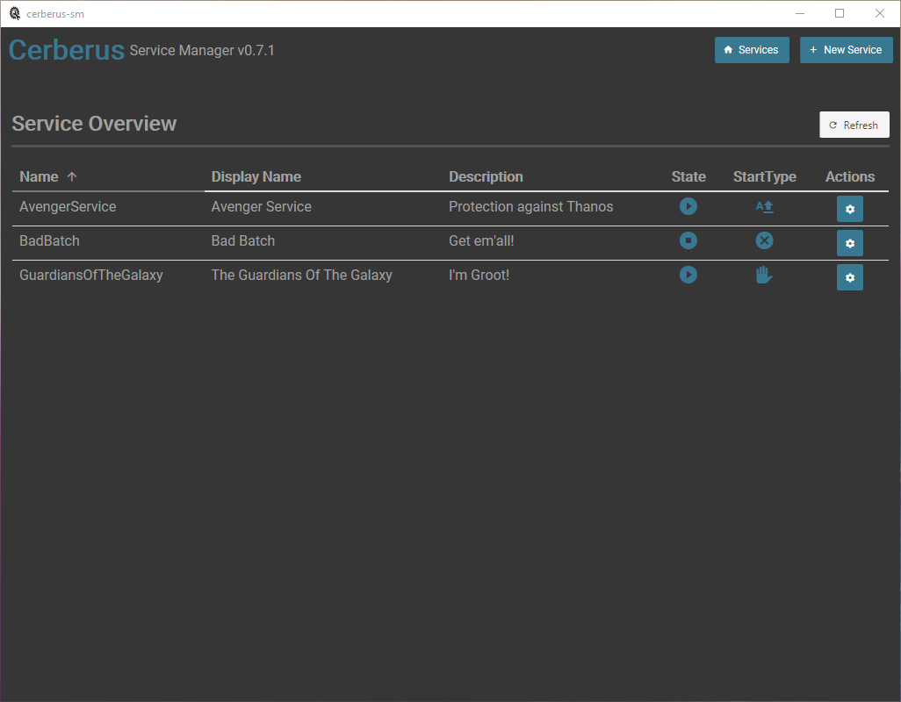
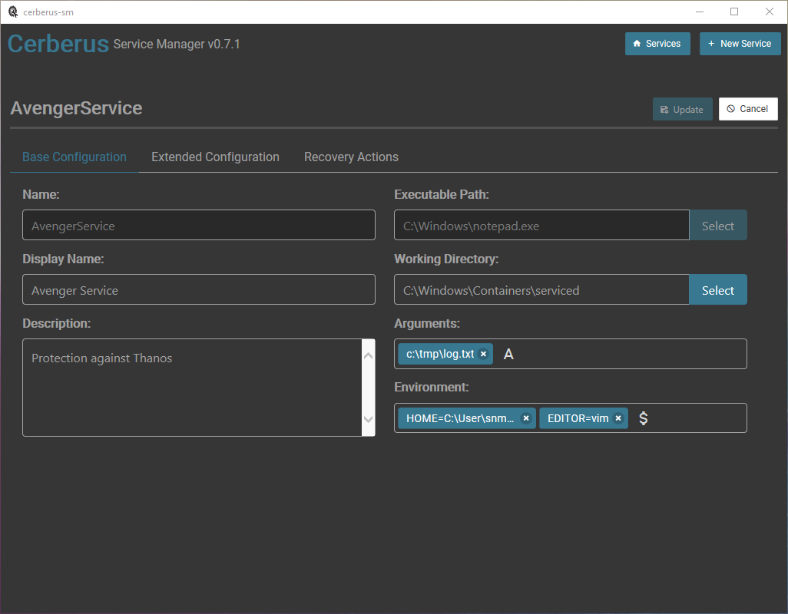
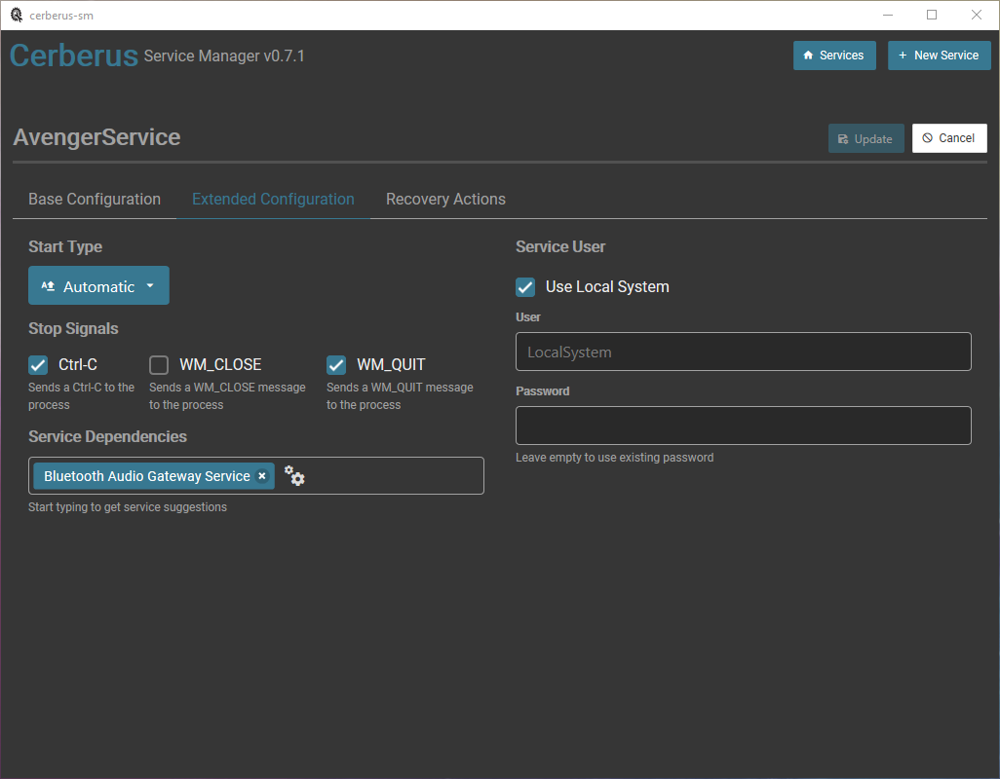
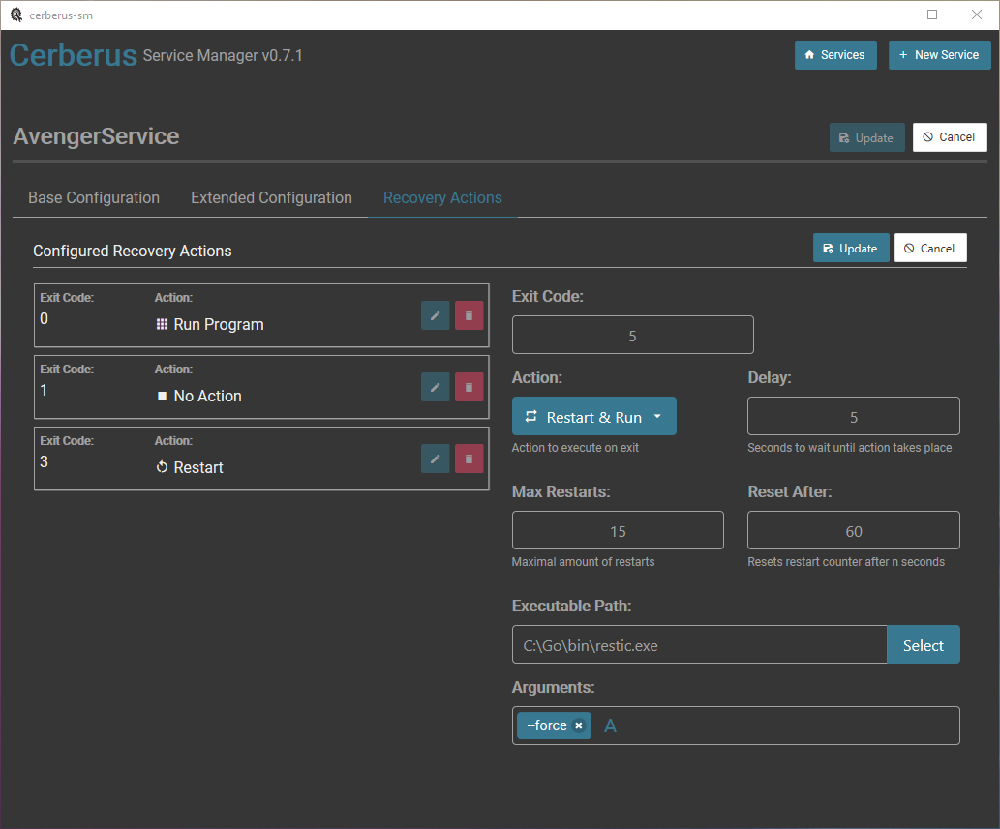

# Cerberus Service Manager
Cerberus Service Manager is a Windows service helper program inspired by NSSM. It can be used to create and manage Windows services for ordinary binaries. If a CLI Tool is preferred, one can use the `cerberus` base program [https://github.com/go-sharp/cerberus](https://github.com/go-sharp/cerberus) (Cerberus Service Manager is based on `cerberus`).

## Installation

Download binary and copy it into the `C:\Program Files\` folder. To start the program double click the binary. 

## Uninstall

First remove all serivces and then delete the binary.

## Screenshots

### Overview

## Base Configuration

## Extended Configuration

## Recovery Actions

